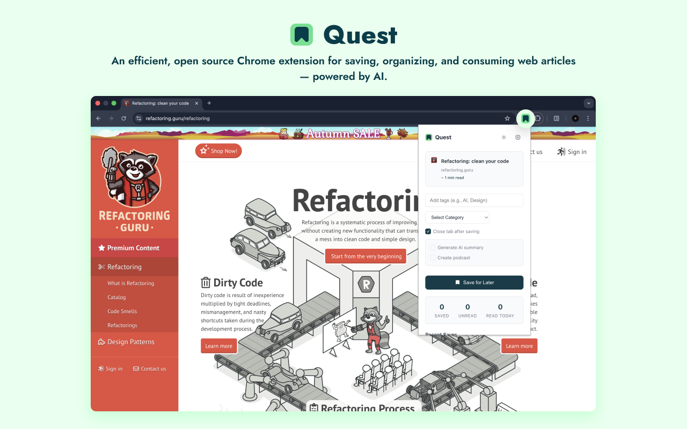

# 📚 Quest - Save & Organize Articles with AI
[](https://www.typescriptlang.org/) [](https://vuejs.org/) [](https://vitejs.dev/) [](LICENSE)

An efficient, open source Chrome extension for saving, organizing, and consuming web articles — powered by AI.



* **Lightweight & Fast**: Minimal resource footprint, no performance impact on browsing
* **Privacy First**: All data stored locally, API keys encrypted client-side
* **AI-Powered**: Optional AI summaries and text-to-speech (bring your own API keys)
* **Open Source**: Free forever, GNU GPL v3.0 licensed

---

##  🚀 Installation
| Browser | Install Link |
|---------|----------------|
| Chrome  | [](https://chrome.google.com/webstore/detail/nklickjfgdodflfpkjljfhhilfnkmhfl) |
| Edge    | [](https://microsoftedge.microsoft.com/addons/detail/quest/nnfdfmboghffjhfabpehmgkhcmiclfea) |
| Firefox | [](https://addons.mozilla.org/en-US/firefox/addon/quest/) *(Coming Soon)* |
---

### Manual Installation (Development)

**For Chrome:**
1. Download or clone this repository
2. Install dependencies: `npm install`
3. Build the extension: `npm run build`
4. Open Chrome and go to `chrome://extensions/`
5. Enable "Developer mode" and click "Load unpacked"
6. Select the `dist/` folder

**For Edge:**
1. Follow steps 1-3 above
2. Open Edge and go to `edge://extensions/`
3. Enable "Developer mode" and click "Load unpacked"
4. Select the `dist/` folder

---

## ✨ Features

**📖 Core Functionality**
- One-click article saving via popup, context menu, or keyboard shortcuts
- Smart organization with categories, tags, and favorites
- Full-text search across all saved articles
- Bulk operations (archive, delete, organize multiple articles)
- Automatic archiving of read articles (optional)
- Reading reminders and progress tracking

**🤖 AI Features** (Optional - Bring Your Own API Keys)
- Generate summaries using OpenAI GPT or Google Gemini
- Convert articles to podcasts with ElevenLabs or Gemini TTS
- Multiple AI models and voices to choose from
- Cost tracking and usage analytics
- All processing happens via your own API keys

**🎨 Interface**
- Clean, modern design with dark mode support
- Grid and list view options
- Responsive dashboard for article management
- Customizable categories with color coding
- Real-time sync across Chrome instances

---

## 🛡️ Privacy & Performance

Quest is designed with privacy and efficiency in mind:

- **No tracking or analytics**: Your reading data stays on your device
- **Local storage**: Articles stored in IndexedDB, settings synced via Chrome Storage
- **Encrypted API keys**: AI keys stored using Web Crypto API (AES-256-GCM)
- **Minimal permissions**: Only requests necessary Chrome permissions
- **Low resource usage**: Lightweight background worker, no always-on processes
- **Open source**: Full transparency — audit the code yourself

---

## ✨ AI Configuration (Optional)

Quest supports multiple AI providers. You must bring your own API keys:

**For Summaries:**
- [OpenAI](https://platform.openai.com/) (GPT-5 series, GPT-4.1 series)
- [Google Gemini](https://ai.google.dev/) (Gemini 2.5 Flash, Pro) — **Recommended** (free tier available)

**For Text-to-Speech:**
- [ElevenLabs](https://elevenlabs.io/) (multiple voices, 10K chars/month free)
- [Google Gemini TTS](https://ai.google.dev/) (30+ voices) — **Recommended** (free tier available)

Configure API keys in Settings → AI Configuration. All AI features are optional and disabled by default.

---

## 🎯 Documentation

- [**Usage Guide**](docs/USAGE.md) — How to save, organize, and use AI features
- [**Contributing**](CONTRIBUTING.md) — Development setup, code style, PR guidelines
- [**Changelog**](CHANGELOG.md) — Version history and release notes

---

## 📦  Building From Source

Requires Node.js 18+ and npm.

```bash
# Install dependencies
npm install

# Development with hot reload
npm run dev

# Production build
npm run build

# Type checking
npm run type-check
```

See [CONTRIBUTING.md](CONTRIBUTING.md) for detailed development instructions.

---

## 🙏 Acknowledgments
### Technologies

- [Vue.js](https://vuejs.org/) - The Progressive JavaScript Framework
- [Vite](https://vitejs.dev/) - Next Generation Frontend Tooling
- [CRXJS](https://crxjs.dev/vite-plugin) - Chrome Extension Vite Plugin
- [TypeScript](https://www.typescriptlang.org/) - JavaScript with Syntax for Types

### AI Services

- [OpenAI](https://openai.com/) - GPT models for intelligent summaries
- [Google Gemini](https://deepmind.google/technologies/gemini/) - Fast, cost-effective AI
- [ElevenLabs](https://elevenlabs.io/) - Realistic text-to-speech voices

---


## 📄 License

[GNU General Public License v3.0](LICENSE)

This is free and open source software. If you need an alternative license, please contact the maintainers.

---

## 🤝 Support & Contributing

- **Bug reports**: [Open an issue](../../issues)
- **Feature requests**: [Start a discussion](../../discussions)
- **Pull requests**: See [CONTRIBUTING.md](CONTRIBUTING.md)

---

<div align="center">

**Happy Reading! 📚**

Made with ❤️ using Vue 3 + TypeScript

[⬆ back to top](#quest)

</div>