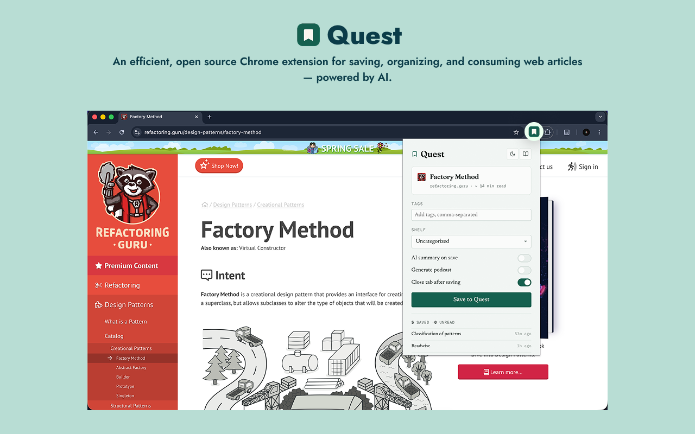
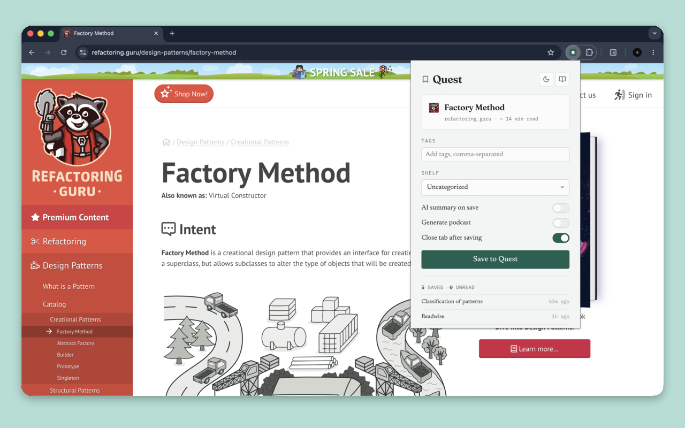
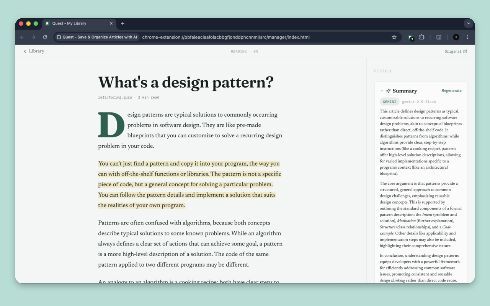
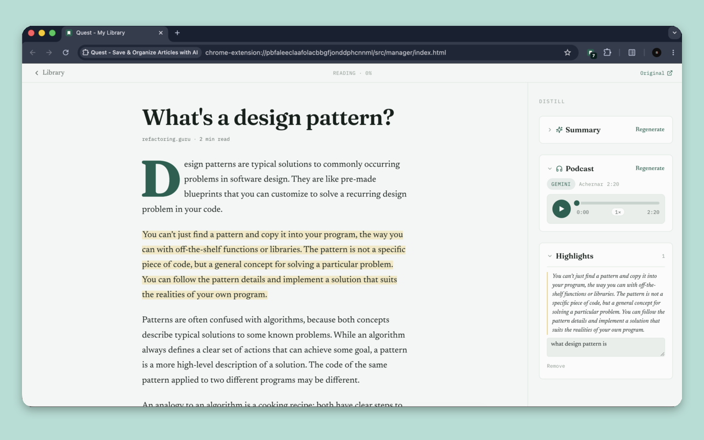
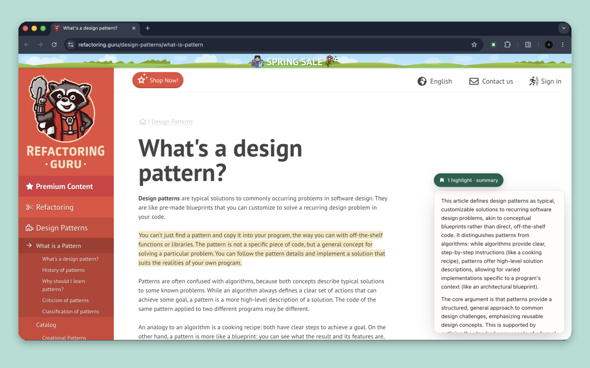

# Quest — Usage Guide

How to save, read, organize, and (optionally) generate AI summaries and podcasts with Quest on Chrome and Edge.

---

## Table of Contents

1. [Getting Started](#getting-started)
2. [Saving Articles](#saving-articles)
3. [The Library](#the-library)
4. [The Reader](#the-reader)
5. [Highlights & Live-Page Annotations](#highlights--live-page-annotations)
6. [Organization](#organization)
7. [AI Features](#ai-features)
8. [Settings](#settings)
9. [Keyboard & Command Palette](#keyboard--command-palette)
10. [Privacy & Data](#privacy--data)
11. [Tips & Troubleshooting](#tips--troubleshooting)

---

## Getting Started

### First launch

- Click the Quest icon in the toolbar to open the **popup** — your one-click
  capture surface.
- Open the **Library** (the full-page manager) from the popup's *Open library*
  button, or the popup masthead's library icon. It opens in its own tab.
- The first time the Library loads with no shelves, Quest seeds four starter
  shelves: **Essays**, **Development**, **Research**, **News**. You can rename,
  recolor, add, or remove them at any time.

### The three surfaces

| Surface | What it's for |
|---------|---------------|
| **Popup** | Quickly save the current page (tags, shelf, AI toggles) |
| **Library** | Browse, search, filter, organize, and open articles |
| **Reader** | A built-in, full-screen reading view with a summary/podcast/highlights rail |

There is no separate dashboard window — AI usage is a panel inside the Library.

---

## Saving Articles

### From the popup

1. Click the Quest icon. The popup shows the page title, domain + favicon, and an
   estimated reading time (word count ÷ 200).
2. Optionally:
   - **Tags** — type and press Enter or comma; suggestions come from your most
     used tags. Backspace removes the last tag.
   - **Shelf** — pick a category (or leave Uncategorized).
   - **AI summary on save** — generate a concise summary in the background.
   - **Generate podcast** — also produce a spoken version.
   - **Close tab after saving** — on by default.
3. Click **Save to Quest**. You'll see a confirmation and an *Open library*
   button; the footer shows your totals and three most recent saves.

The AI toggles default to your **Automation** settings. Quest extracts the
article body when saving (it asks the page's content script first, then falls
back to injecting a one-off extractor, keeping whichever yields more text).

### From the right-click menu

Right-click to save without opening the popup:

- **Save Page to Quest** — the current page
- **Save Link to Quest** — a link you're hovering
- **Save Selection to Quest** — selected text (used as the title)

### From the Library

Use **Add by URL** (the `+` in the header, or the command palette) to add an
entry by URL and optional title. This creates a bookmark stub without an
extracted body — best for pages you can't open right now. Open the original
later to capture full text by re-saving.

### Duplicates & auto-read

- **Deduplication**: URLs are normalized (https, no `www.`, no trailing slash,
  tracking params and the `#fragment` dropped), so the same article saved with
  different tracking links is matched as one. The popup shows the page as already
  saved when it matches.
- **Auto-read**: when you open a saved article's URL in the browser, Quest marks
  it **read** and updates the unread badge.

---

## The Library

### Header

- **Brand** + **search** (filters by title, domain, excerpt, and tags as you
  type — case-insensitive).
- **Add by URL** (`+`), **AI usage** (chart), **theme toggle** (Paper/Ink), and
  **Settings** (gear).
- `⌘K` / `Ctrl+K` opens the **command palette**.

### Left rail

- **Contents** — views with live counts: **All**, **Unread**, **Reading**,
  **Favorites**, **Archive**.
- **Shelves** — your categories with per-shelf counts. Hover a shelf for **edit**
  and **delete**; the `+` creates a new shelf.
- **Tags** — your most-used tags; click one to filter.

### Toolbar & cards

- **Sort**: Newest first, Oldest first, Title A–Z, Title Z–A, Source.
- **View**: list or grid.
- **Select**: enter selection mode for bulk actions.

Each **entry card** shows the title, domain, reading time, and status, plus small
indicators — a **sparkles** icon if it has a summary and a **headphones** icon if
it has a podcast. Hover (when not selecting) for quick actions: **Pin/Unpin**,
**Archive/Unarchive**, **Delete**. Clicking the card opens it in the Reader.

Long lists paginate (24 per page).

### Bulk actions

Click **Select**, tick the cards you want, and use the floating bar at the bottom:

- **Read** — mark read
- **Pin** — toggle favorite
- **Archive**
- **Group** — let AI assign a shelf and tags to each
- **Delete**

**Done** exits selection mode.

---

## The Reader

Clicking an article opens Quest's built-in Reader (opening an unread article
moves it to **Reading**). It's a full-screen, two-column view:

- A top **progress bar** tracks and saves how far you've scrolled.
- The header has **‹ Library**, the read status, and an **Original ↗** link to
  the source page.
- The article renders in an editorial serif layout with a drop-cap lead
  paragraph. If no body text was captured, you'll be pointed to the original.

On the right is the **Distill** rail:

- **Summary** — *Generate* (or *Regenerate*); shows the provider and model and
  renders the summary as formatted text.
- **Podcast** — *Generate* (or *Regenerate*); shows provider, voice, and
  duration with an audio player.
- **Highlights** — every highlight on the article, each with an optional note and
  a *Remove* action.

Each card collapses from its header, so you can keep just what you're using open.

---

## Highlights & Live-Page Annotations

### Highlighting in the Reader

Select text in the Reader and click **Highlight**. (Highlights are anchored
within a single paragraph.) Each highlight appears in the Highlights card where
you can add a note or remove it.

### On the original page

When you revisit a page that's saved in Quest, the content script:

- Re-renders your highlights directly on the live page (matched by text, since
  the live DOM differs from the captured copy).
- Shows a **green pill** in the bottom-right. If the article has a summary, click
  the pill to expand it and read the summary in place.

> If the pill doesn't appear during local development, reload the extension at
> `chrome://extensions/` and reload the page — each build replaces the
> content-script files (see CONTRIBUTING.md).

---

## Organization

### Shelves (categories)

A shelf is a single broad category per article, with a color.

- **Create**: `+` next to *Shelves*, name it, pick a color (8 colors).
- **Edit / Delete**: hover the shelf in the rail. A shelf with articles can't be
  deleted until you move or remove them.

### Tags

Multiple tags per article, lowercased, tracked with a usage count. Your most-used
tags surface in the rail and as suggestions in the popup. Click a tag to filter.

### Favorites & Archive

- **Pin** an article (star) to find it under **Favorites**.
- **Archive** to clear it from the main views without deleting it; **Archive** in
  the rail lists them, and you can unarchive anytime.
- **Auto-archive** (optional, in Settings) tidies away **read** articles after a
  set number of days, runs daily, and never touches pinned articles.

---

## AI Features

AI is **optional** and **off by default**. You bring your own API keys; calls go
directly from your browser to the provider.

### Providers, models & voices

**Summaries**

- **OpenAI** — GPT-5 Nano, GPT-5 Mini, GPT-5, GPT-4.1 Nano, GPT-4.1 Mini, GPT-4.1
- **Google Gemini** — Gemini 2.5 Flash-Lite, Gemini 2.5 Flash, Gemini 2.5 Pro
  *(Gemini 2.5 Flash is the default)*

**Podcasts (text-to-speech)**

- **Google Gemini TTS** — Gemini 2.5 Flash TTS, Gemini 2.5 Pro TTS (30 voices)
  *(default)*
- **ElevenLabs** — Flash v2.5, Turbo v2.5, Multilingual v2, v3 (8 voices)

### Setup

1. Get a key from your provider:
   [OpenAI](https://platform.openai.com/), [Google Gemini](https://ai.google.dev/)
   (free tier available), or [ElevenLabs](https://elevenlabs.io/).
2. Open **Settings**.
   - Under **AI Summaries**, choose a provider and model.
   - Under **Podcasts**, choose a voice provider and voice.
   - Under **API Keys**, paste the key. Quest only shows the keys for the
     providers you've selected. Click **Test** to verify, then **Save settings**.

Keys are encrypted on your device and never synced.

### Summaries

Two kinds:

- **Concise** — a tight ~200–300-word overview, plain prose. This is what the
  Reader's *Generate* button and *AI summary on save* produce.
- **Extended** — a longer, conversational, spoken-style retelling whose length
  scales with the article. This is what a podcast is generated from.

Generation is **idempotent**: regenerating replaces the existing summary of that
kind rather than piling up duplicates. Summaries render with formatting (bold,
italics, lists, code, links) in the Reader and on the live-page pill.

### Podcasts

From the Reader's Podcast card (or *Generate podcast* on save), Quest produces an
extended summary first if one doesn't exist, then synthesizes speech with your
chosen voice. Audio is stored **locally** (MP3 from ElevenLabs, WAV from Gemini).
The player supports play/pause, scrubbing, and a playback-speed control (1× →
1.25× → 1.5× → 2×). Regenerating replaces the prior audio.

### AI grouping

Let AI choose a shelf and tags for you:

- **On save** — enable *AI grouping on save* in Settings.
- **In bulk** — select articles in the Library and choose **Group**.

It prefers an existing shelf when one fits and otherwise proposes a short new one.

### AI usage

The **AI usage** panel (chart icon in the header) shows totals — summaries,
podcasts, requests, and estimated cost — plus a recent-activity log with the
operation, provider, time, and success/failure.

---

## Settings

Open from the gear icon in the Library header.

- **Appearance** — theme: **Paper** (light) or **Ink** (dark).
- **AI Summaries** — summary provider and model.
- **Podcasts** — voice provider and voice.
- **API Keys** — only the providers you're using; paste, **Test**, save. Keys are
  encrypted locally and never synced.
- **Automation**
  - **Summarise on save** — generate a summary on every save.
  - **Podcast on save** — also produce a spoken version.
  - **AI grouping on save** — let AI pick the shelf and tags.
  - **Auto-archive** — tidy away read articles, with an *Archive after N days*
    field.

Settings sync across your Chrome/Edge instances (API keys do not).

---

## Keyboard & Command Palette

Quest is mouse-first, with one shortcut:

- **`⌘K` / `Ctrl+K`** — open the command palette.

In the palette, type to search your articles or filter commands (Add by URL, open
Settings, AI usage, toggle theme, jump to a view). Navigate with **↑ / ↓**,
**Enter** to run, **Esc** to close. **Esc** also closes modals.

---

## Privacy & Data

- **Articles, summaries, audio, and highlights** live in a local **IndexedDB**
  (`quest`) on your device — nothing is uploaded to a Quest server.
- **Settings** sync via Chrome Storage; **API keys** are encrypted on the device
  and are never synced.
- **AI calls** go directly from your browser to the provider you configured.
- **Migration**: the first time the updated extension runs, your data from the
  previous version is imported automatically into the new store.

---

## Tips & Troubleshooting

### Workflow tips

- Save fast from the popup or right-click. Set a shelf and tags as you save, or
  let **Group** sort things out for you afterward.
- Use **Extended** summaries when you plan to listen — they're written to be
  spoken.
- Prefer **Gemini** for low-cost summaries and TTS; switch providers per task in
  Settings.

### Common issues

**Can't find a saved article**
- Check the **Archive** view, or search by title/domain. Remember archived
  articles are hidden from All/Unread.

**The green pill / highlights don't show on a page**
- In development, reload the extension and the page after a build.
- Confirm the page is actually saved (the popup will show it as saved).

**AI features fail**
- Verify the key in Settings with **Test**; check the provider for quota/credits.

**"Article content is too short"**
- The page body wasn't captured (e.g. a stub added by URL, or a page that blocks
  extraction). Open the original and re-save to capture the text.

**Podcast won't generate**
- It needs article text to summarize first; see the note above.

### Getting help

- **Bug reports**: open an issue
- **Questions / ideas**: start a discussion
- **Service-worker console**: `chrome://extensions/` → *Service worker* for
  background errors

---

**Happy reading.** 📚

[← Back to README](../README.md)

