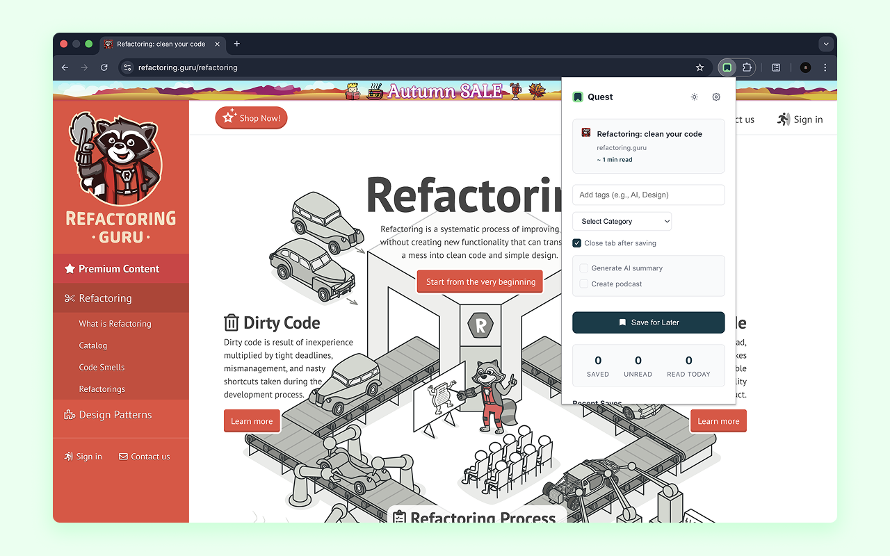

# Quest - Usage Guide

A comprehensive guide to using all features of Quest.

---

## Table of Contents

1. [Getting Started](#getting-started)
2. [Saving Articles](#saving-articles)
3. [Managing Articles](#managing-articles)
4. [Organization Features](#organization-features)
5. [AI Features](#ai-features)
6. [Settings & Configuration](#settings--configuration)
7. [Import & Export](#import--export)
8. [Keyboard Shortcuts](#keyboard-shortcuts)
9. [Tips & Best Practices](#tips--best-practices)

---

## Getting Started

### First Launch

When you first install Quest:

1. Click the extension icon in your browser toolbar
2. The popup will appear (360px width, compact design)
3. Default categories are automatically created:
   - **Uncategorized**
   - **Tech**
   - **News**
   - **Personal**
   - **Work**
   - **Research** 
   - **General**
   - **Articles**
   - **Development** 
   - **Videos**

### Interface Overview

Quest has three main interfaces:

- **Popup** (360x480px) - Quick saving and stats
- **Manager Dashboard** - Full article library management
- **AI Dashboard** - Usage analytics and audit logs

---

## Saving Articles

### Method 1: Extension Popup

The fastest way to save the current page:

1. **Click the extension icon** while on any webpage
2. The popup automatically loads:
   - Page title
   - Domain and favicon
   - Estimated reading time (based on word count)
3. **Customize your save** (optional):
   - Add tags (comma-separated: `javascript, tutorial, web-dev`)
   - Select a category from dropdown
   - Enable "Close tab after saving" to auto-close
   - Enable "Generate AI Summary" for instant summary
   - Enable "Create Podcast" for text-to-speech audio
4. **Click "Save Article"**
5. Success! You'll see:
   - Quick Stats updated (Saved, Unread, Read Today)
   - Article appears in Recent Saves

**Auto-Detection Features:**
- Automatically extracts article content
- Calculates reading time (~200 words per minute)
- Captures favicon for visual recognition
- Normalizes URL to prevent duplicates

### Method 2: Context Menu (Right-Click)

Save without opening the popup:

**Save Current Page:**
1. Right-click anywhere on the page
2. Select **"Save Page to Quest"**
3. Article saved with smart category auto-detection

**Save a Link:**
1. Right-click any link
2. Select **"Save Link to Quest"**
3. Link saved for later reading

**Save Selected Text:**
1. Highlight text on any page
2. Right-click the selection
3. Select **"Save Selection to Quest"**
4. Creates article with selected text as title

**Smart Category Detection:**
- `github.com`, `stackoverflow.com` → Tech
- `nytimes.com`, `bbc.com` → News
- All others → Uncategorized

### Method 3: Manual Entry

Add articles that you can't visit directly:

1. Open Manager Dashboard
2. Click **"+"** button in header
3. Fill in the Article Modal:
   - **URL** (required) - Full article URL
   - **Title** (required) - Article title
   - **Category** - Select from dropdown
   - **Tags** - Add multiple tags (press Enter or comma)
   - **Pin** - Mark as favorite
   - **Mark as read** - Already read it?
4. Click **"Add Article"**

**Tag Suggestions:**
- As you type, existing tags appear
- Click a suggestion to add it
- Prevents duplicate/similar tags

### Duplicate Prevention

Quest automatically prevents duplicate saves:

- URLs are normalized (removes tracking params)
- `https://example.com/article?utm_source=...` becomes `https://example.com/article`
- If article exists, you'll see **"Already Saved"** button
- Click it to jump to the article in Manager

### Automatic Reading Detection

When you visit a saved article:

- Extension detects you're reading it
- Automatically marks as **Read**
- Sets `dateRead` timestamp
- Updates "Read Today" counter
- Badge count updates in real-time

---

## Managing Articles

### Manager Dashboard

Open the full manager:
- Click **"View All"** in popup, or
- Click extension icon → **"Manager"**, or
- Right-click extension icon → **"Manager"**

### Dashboard Layout

**Header (Top Bar):**
- Logo and "My Library" title
- **Search bar** - Search by title, content, or metadata
- **Add Article** (+) - Manual entry modal
- **Export/Import** - Backup/restore data
- **AI Dashboard** - View usage analytics
- **Theme Toggle** - Switch light/dark mode
- **Settings** (⚙️) - Configure extension

**Sidebar (Left Panel):**
- **Views** - Filter by status
  - All Articles (total count)
  - Reading List (unread count)
  - Favorites (pinned count)
  - Archive (archived count)
- **Categories** - Filter by category
  - Click category to filter
  - See article count per category
  - Right-click for options (Edit/Delete)
  - **+** button to create new category

**Main Content Area:**
- Article cards in grid or list view
- View selector (Grid/List) at top
- Sort options:
  - Date Added (newest/oldest)
  - Title (A-Z)
  - Reading Time (shortest/longest)
- Filter controls:
  - By category, tag, or domain
  - Read/Unread status
  - Show/hide archived

### Article Card Actions

Each article card shows:

**Article Information:**
- Favicon and title
- Domain and reading time
- Category (colored dot)
- Tags (clickable badges)
- Date added (relative: "2 hours ago")
- Read status indicator

**Quick Actions (Hover):**
- **Open** - View article in new tab
- **Pin/Unpin** - Toggle favorite status
- **Archive** - Move to archive
- **Delete** - Remove permanently

**AI Features (if available):**
- **Summary badge** - Click to view summary
- **Podcast badge** - Click to listen
- **Generate Summary** - Create AI summary
- **Create Podcast** - Convert to audio

### Bulk Operations

Select multiple articles for batch actions:

1. **Enable Select Mode:**
   - Click checkbox icon in toolbar, or
   - Check any article's checkbox
2. **Select Articles:**
   - Check individual checkboxes
   - Or use "Select All" at top
3. **Perform Actions:**
   - Mark as Read/Unread
   - Archive/Unarchive
   - Delete (with confirmation)
   - Change Category
   - Add Tags
4. **Exit Select Mode:**
   - Click checkbox icon again
   - Or click "Deselect All"

### Searching Articles

**Full-Text Search:**
- Search bar in header
- Searches across:
  - Article titles
  - Article content
  - Tags
  - Domains
- Real-time filtering
- Case-insensitive

**Search Tips:**
- `javascript` - Finds all JS articles
- `tutorial` - Finds all tutorials
- `github.com` - All GitHub articles
- Combine with filters for precision

### Sorting & Filtering

**Sort Options:**
- **Date Added** - Newest or oldest first
- **Title** - Alphabetical A-Z or Z-A
- **Reading Time** - Shortest or longest

**Filter Options:**
- **Category** - Show single category
- **Tag** - Click tag badge to filter
- **Domain** - Filter by source website
- **Status** - Read, Unread, Archived
- **Pinned** - Favorites only

**Multi-Filter:**
- Combine filters for precise results
- Example: "Tech" category + "Unread" + "tutorial" tag
- Clear filters individually or all at once

---

## Organization Features

### Categories

**Purpose:**
- Broad topic grouping
- Color-coded for visual scanning
- One category per article

**Create Category:**
1. Click **+** next to "Categories" in sidebar
2. Enter category name
3. Choose a color (16 colors available)
4. Click **"Create Category"**

**Edit Category:**
1. Right-click category in sidebar
2. Select **"Edit Category"**
3. Change name or color
4. Click **"Save"**

**Delete Category:**
1. Right-click category in sidebar
2. Select **"Delete Category"**
3. **Note:** Cannot delete if articles exist
4. Move articles first, then delete

**Category Colors:**
- Gray, Blue, Green, Red, Yellow, Purple, Pink, Teal
- Orange, Indigo, Lime, Cyan, Amber, Rose, Sky, Violet

### Tags

**Purpose:**
- Multi-dimensional organization
- Multiple tags per article
- Flexible, organic structure

**Add Tags:**
- When saving: comma-separated in popup
- In Manager: Edit article modal
- Auto-suggestions from existing tags

**Tag Filtering:**
- Click any tag badge to filter
- See all articles with that tag
- Combine with other filters

**Tag Management:**
- Tags are tracked with usage count
- Popular tags appear first in suggestions
- Unused tags automatically cleaned up

### Favorites (Pinned Articles)

**Pin Articles:**
- Click pin icon on article card
- Or check "Pin" in article modal
- Appears in "Favorites" view

**Uses:**
- Important references
- Currently reading
- High-priority items
- Bookmark frequently accessed

### Archive

**Purpose:**
- Declutter main library
- Keep read articles organized
- Auto-archive old reads

**Manual Archive:**
- Click archive icon on article
- Or bulk archive multiple articles

**Auto-Archive:**
- Enable in Settings
- Set days after reading (1-365)
- Runs daily in background
- Only archives read articles

**Viewing Archive:**
- Click "Archive" in sidebar
- Shows all archived articles
- Can unarchive anytime

---

## AI Features

Quest supports multiple AI providers. **You must bring your own API keys.**

### Supported Providers

**Summary Providers:**
- **OpenAI** - GPT-4o-mini, GPT-4.1, GPT-3.5-turbo, GPT-4
- **Google Gemini** - Gemini 2.5 Flash, Gemini 2.5 Pro, Gemini 1.5 Pro

**TTS (Text-to-Speech) Providers:**
- **ElevenLabs** - 4 voice models, multiple voices
- **Google Gemini TTS** - 30+ high-quality voices

### Setting Up AI

**Get API Keys:**

1. **OpenAI:**
   - Visit [platform.openai.com](https://platform.openai.com/)
   - Create account or sign in
   - Go to API Keys section
   - Create new secret key
   - Copy and save securely

2. **Google Gemini:**
   - Visit [ai.google.dev](https://ai.google.dev/)
   - Get API key (free tier available)
   - 15 requests/minute free
   - 100 requests/day for TTS

3. **ElevenLabs:**
   - Visit [elevenlabs.io](https://elevenlabs.io/)
   - Sign up for account
   - Get API key from profile
   - 10,000 characters/month free

**Configure in Extension:**

1. Open Manager → Settings (⚙️)
2. Scroll to **"AI Summary Configuration"**
3. Choose provider (OpenAI or Gemini)
4. Enter API key
5. Click **"Test Connection"**
6. Select model (optional)
7. Click **"Save Settings"**

**For TTS:**
1. Scroll to **"Text-to-Speech Configuration"**
2. Choose provider (ElevenLabs or Gemini)
3. Enter API key
4. Click **"Test Connection"**
5. Select voice (if ElevenLabs)
6. Click **"Save Settings"**

**Security:**
- API keys encrypted with AES-256-GCM
- Stored using Web Crypto API
- Never transmitted to our servers
- Only used for direct API calls

### Generating Summaries

**Two Summary Types:**

1. **Concise Summary** (~200 tokens)
   - Quick overview
   - Main points only
   - Fast generation
   - Lower cost

2. **Extended Summary** (~800 tokens)
   - Detailed breakdown
   - Key insights
   - Supporting details
   - Better for podcasts

**Generate Summary:**

**Method 1: During Save**
1. In popup, check **"Generate AI Summary"**
2. Save article
3. Summary generates in background
4. View in Manager when ready

**Method 2: From Manager**
1. Click article's **"Generate Summary"** button
2. Choose type (Concise or Extended)
3. Wait for generation (5-30 seconds)
4. Summary badge appears when done

**View Summary:**
1. Click **"Summary"** badge on article
2. Summary modal opens showing:
   - Full summary text
   - Summary type (Concise/Extended)
   - Token usage
   - Estimated cost
   - Generation timestamp
3. **Actions:**
   - Regenerate (create new version)
   - Copy to clipboard
   - Close modal

**Summary Features:**
- Stored permanently with article
- Supports both types per article
- Includes token/cost tracking
- Can regenerate anytime

### Creating Podcasts

**Requirements:**
- Article must have **Extended Summary**
- Generate extended summary first
- TTS provider configured

**Generate Podcast:**

**Method 1: During Save**
1. Check **"Create Podcast"**
2. Ensure extended summary enabled
3. Save article
4. Podcast generates in background

**Method 2: From Manager**
1. Ensure article has extended summary
2. Click **"Create Podcast"** button
3. Choose TTS provider (if prompted)
4. Select voice (if ElevenLabs)
5. Wait for generation (30-90 seconds)

**Listen to Podcast:**
1. Click **"Podcast"** badge on article
2. Audio player modal opens with:
   - Play/Pause controls
   - Progress bar
   - Current time / Total duration
   - Playback speed (0.5x - 2x)
   - Volume control
3. **Actions:**
   - Play/Pause audio
   - Seek to position
   - Adjust playback speed
   - Download audio file
   - Inject into page (listen while browsing)
   - Close modal

**Podcast Features:**
- Stored as WAV audio locally
- Offline playback support
- Natural-sounding voices
- Variable playback speed
- Download for external use

### AI Dashboard

**View Analytics:**
1. Open Manager
2. Click **AI Dashboard** icon in header
3. See comprehensive stats:

**Usage Statistics:**
- Total API calls
- Summaries generated
- Podcasts created
- Total tokens used
- Estimated total cost
- Cost per provider

**Audit Logs:**
- All AI operations logged
- Filter by:
  - Operation type (summary/podcast)
  - Provider (OpenAI/Gemini/ElevenLabs)
  - Date range
- Details per operation:
  - Article title
  - Operation type
  - Provider and model
  - Tokens used
  - Cost
  - Timestamp
  - Success/Error status

**Cost Tracking:**
- Real-time cost calculation
- Per-provider breakdown
- Token usage analytics
- Helps manage API budgets

---

## Settings & Configuration

Access Settings: Manager → ⚙️ icon

### General Settings

**Theme:**
- Light mode (default)
- Dark mode
- Syncs across all extension pages
- System dark mode compatible

**Default Category:**
- Category for new articles
- Applies when no category selected
- Defaults to "Uncategorized"

### Auto-Archive Settings

**Enable Auto-Archive:**
- Toggle on/off
- Archives read articles automatically
- Runs daily via Chrome Alarms

**Archive After (Days):**
- Set 1-365 days
- Counts from `dateRead` timestamp
- Example: Set to 30 = archives after 30 days of reading
- Only applies to read articles
- Pinned articles protected from auto-archive

**How It Works:**
1. Daily background check (configurable time)
2. Finds articles marked as read
3. Checks if days elapsed ≥ setting
4. Archives eligible articles
5. Skips pinned articles

### Reminder Settings

**Enable Reminders:**
- Toggle reading reminders on/off
- Chrome notification support

**Reminder Time:**
- Set specific time (24-hour format)
- Daily reminder to read saved articles
- Shows unread count in notification

**Notification Actions:**
- Click to open Manager
- Dismiss reminder

### AI Settings

**Auto Summary:**
- Enable to generate summaries on save
- Applies to popup saves
- Uses concise summary by default
- Requires API key configured

**Auto Podcast:**
- Enable to generate podcasts on save
- Requires extended summary first
- Generates after summary completes
- Uses configured TTS provider

**Summary Provider:**
- Choose OpenAI or Gemini
- Different models available
- Cost/speed tradeoffs
- **Recommended:** Gemini (free tier, fast)

**TTS Provider:**
- Choose ElevenLabs or Gemini
- Voice quality differences
- Different pricing
- **Recommended:** Gemini (affordable, good quality)

### Model Selection

**OpenAI Models:**
- **GPT-4o-mini** - Fast, affordable (~$0.0003/summary)
- **GPT-4.1** - Best quality (~$0.01/summary)
- **GPT-3.5-turbo** - Budget option
- **GPT-4** - Premium quality

**Gemini Models:**
- **Gemini 2.5 Flash** - Fastest (~$0.00001/summary) ⭐
- **Gemini 2.5 Pro** - Best quality (~$0.0001/summary)
- **Gemini 1.5 Pro** - Balanced option

**ElevenLabs Models:**
- **Flash v2.5** - Fastest
- **Turbo v2.5** - Fast and natural
- **Multilingual v2** - Multi-language
- **v3** - Best quality

**ElevenLabs Voices:**
- Multiple male/female voices
- Preview available in settings
- Natural intonation
- Emotional expression

**Gemini TTS Voices:**
- 30+ high-quality voices
- Multiple languages
- Male/female options
- Studio quality

### Data Management

**Storage Information:**
- View total articles saved
- IndexedDB size
- Audio files size
- Category/tag counts

**Clear Data:**
- Clear all articles (irreversible)
- Clear summaries only
- Clear audio files only
- Export first for backup!

---

## Import & Export

### Export Your Library

**Full Export:**
1. Open Manager
2. Click **Export/Import** icon in header
3. Click **"Export All Data"**
4. Choose what to export:
   - ✅ Articles
   - ✅ Categories
   - ✅ Tags
   - ✅ Settings
   - ✅ Summaries
   - ⚠️ Audio files (warning: large size)
5. Click **"Export"**
6. JSON file downloads: `quest-backup-YYYY-MM-DD.json`

**Selective Export:**
- Export filtered articles only
- Apply filters first
- Export → Select visible only

**Export Format:**
- JSON file
- Human-readable
- Includes all metadata
- Audio as base64 (if included)

### Import Data

**Import Backup:**
1. Open Manager → Export/Import
2. Click **"Import Data"**
3. Choose JSON file
4. Select import mode:
   - **Merge** - Add to existing data (duplicates skipped)
   - **Replace** - Clear existing, import fresh
5. Click **"Import"**
6. Wait for completion
7. Success notification shows counts

**Import Validation:**
- Validates JSON structure
- Checks for required fields
- Reports errors clearly
- Partial imports supported

**What's Imported:**
- All articles with content
- Categories (with colors)
- Tags (with usage counts)
- Settings (optional)
- Summaries (if available)
- Audio files (if included)

**Merge Behavior:**
- Skips duplicate URLs
- Preserves existing data
- Adds new categories/tags
- Combines intelligently

**Replace Behavior:**
- Clears all existing data
- Fresh start
- Use with caution!
- Export first for safety

---

## Keyboard Shortcuts

### Global Shortcuts

Currently, Quest uses mouse/click interactions. Keyboard shortcuts planned for v1.1.0.

**Planned Shortcuts:**
- `Ctrl+Shift+S` - Save current page
- `Ctrl+Shift+M` - Open Manager
- `Ctrl+Shift+F` - Focus search
- `Escape` - Close modals
- `Arrow keys` - Navigate articles
- `Enter` - Open selected article

**Vote for Shortcuts:**
Open a discussion on GitHub to request specific shortcuts!

---

## Tips & Best Practices

### Organization Strategy

**Use Categories for Broad Topics:**
- Tech, News, Personal, Work, Hobbies
- Keep it simple (5-10 categories max)
- Color-code for visual scanning

**Use Tags for Specifics:**
- `javascript`, `tutorial`, `to-read`, `reference`
- Multi-dimensional organization
- Easy filtering and search

**Pin Important Articles:**
- Current reading list
- Reference materials
- High-priority items
- Frequently accessed

**Archive Regularly:**
- Enable auto-archive
- Keep main library focused
- Archive = done, not deleted
- Can always search archive

### Reading Workflow

**Recommended Flow:**

1. **Save Everything Quickly**
   - Right-click to save
   - Don't overthink categories
   - Add tags later if needed

2. **Review in Manager**
   - Open Manager daily/weekly
   - Scan "Reading List" view
   - Pin important articles
   - Archive or delete uninteresting

3. **Read and Archive**
   - Articles auto-mark as read
   - Auto-archive after X days
   - Keep library clean

4. **Search When Needed**
   - Use full-text search
   - Filter by tags/categories
   - Quick access to references

### AI Usage Tips

**When to Use AI:**
- **Long articles** - Summaries save time
- **Technical content** - Quick understanding
- **Research** - Multiple articles, compare summaries
- **Podcasts** - Listen while commuting/exercising

**Cost Management:**
- Use **Gemini** for summaries (nearly free)
- Use **Gemini TTS** for podcasts (affordable)
- Monitor usage in AI Dashboard
- Set personal budget limits

**Quality Tips:**
- Extended summaries better for podcasts
- Regenerate if summary unclear
- Try different models for comparison
- Preview voices before bulk generation

### Performance Tips

**Keep Library Manageable:**
- Archive old/read articles
- Delete uninteresting saves
- Export and clear periodically
- Target: <1000 active articles

**Search Efficiently:**
- Use specific keywords
- Combine with filters
- Sort by relevance
- Tag well for better finding

**Backup Regularly:**
- Export monthly
- Store backups safely
- Test imports occasionally
- Before major changes

### Privacy & Security

**Your Data is Safe:**
- All local storage (IndexedDB)
- No cloud uploads
- API keys encrypted
- Open source = auditable

**API Key Security:**
- Never share your keys
- Rotate keys periodically
- Monitor usage on provider dashboards
- Revoke if compromised

**Chrome Sync:**
- Only settings sync across devices
- Articles stay local per device
- Disable sync in settings if needed

---

## Troubleshooting

### Common Issues

**"Already Saved" but can't find article:**
- Check Archive view
- Search by title/domain
- URL might be normalized differently

**Article won't save:**
- Check if URL is valid
- Try manual entry in Manager
- Check browser console for errors

**AI features not working:**
- Verify API key in Settings
- Test connection
- Check provider dashboard for credits
- See browser console for errors

**Podcast won't play:**
- Ensure extended summary exists
- Check if audio generated
- Try regenerating podcast
- Check browser audio permissions

**Extension feels slow:**
- Archive old articles
- Clear unused summaries/audio
- Export and fresh start
- Check IndexedDB size

### Getting Help

- **GitHub Issues:** Report bugs
- **GitHub Discussions:** Ask questions
- **Documentation:** Re-read this guide
- **Browser Console:** Check for errors

---

## What's Next?

**Upcoming Features (v1.1.0):**
- Keyboard shortcuts
- Advanced search filters
- Reading statistics dashboard
- Firefox support
- More AI models and voices
- PDF support
- Browser sync (optional)

**Vote for Features:**
Open discussions on GitHub to request features!

---

**Happy Reading!** 📚

Need help? [Open an issue](https://github.com/yourusername/quest/issues)

[← Back to README](../README.md)

